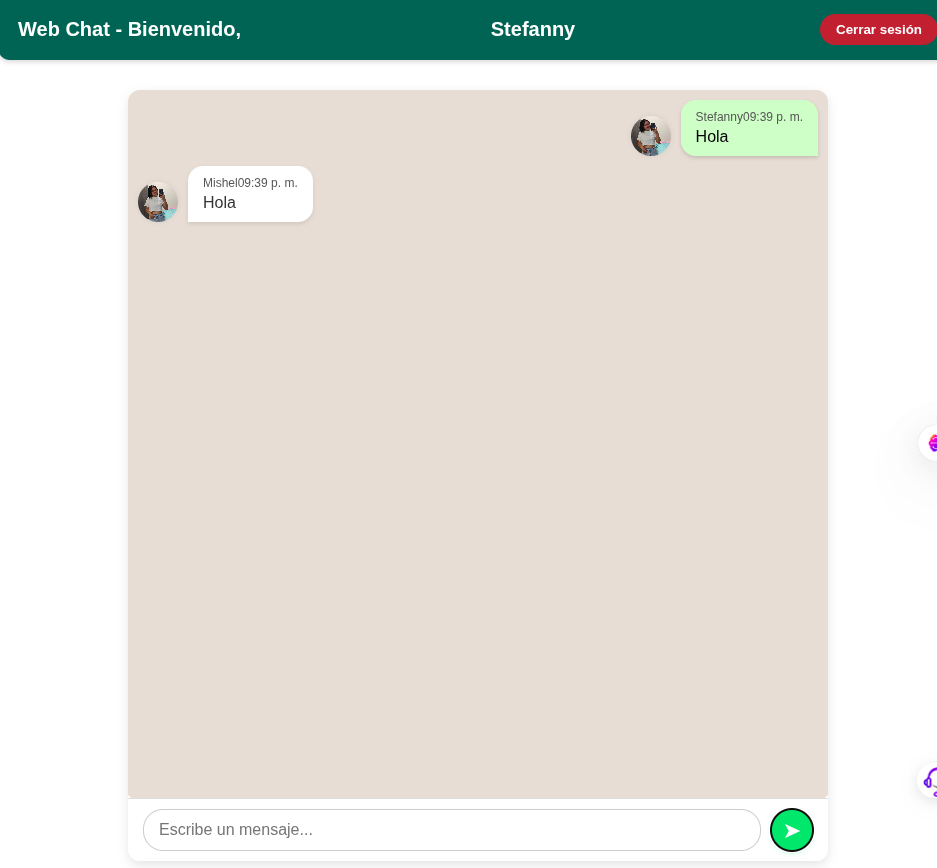
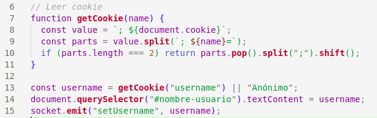
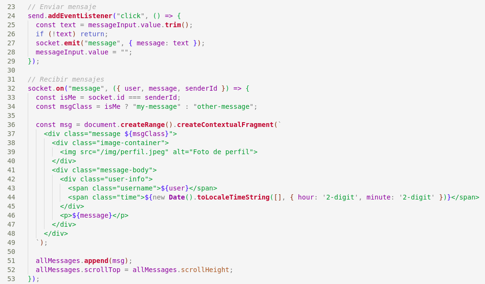
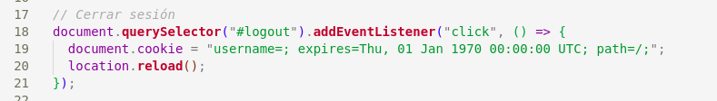
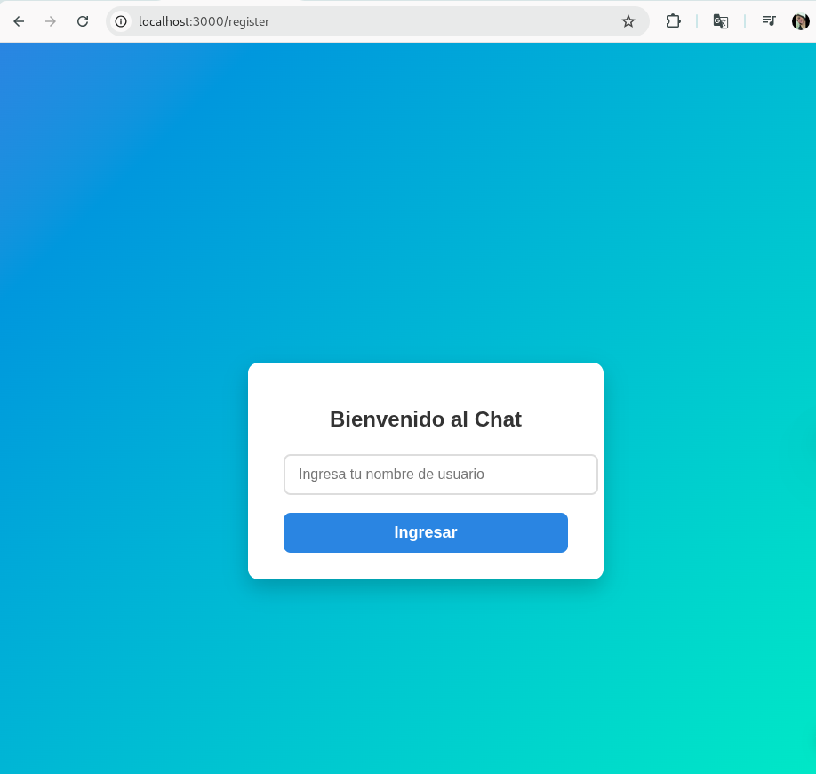
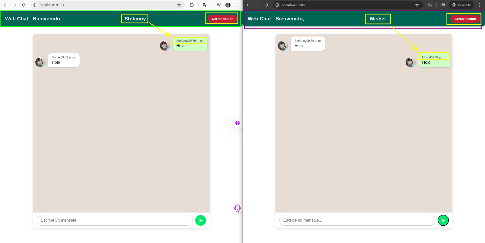

# Chat en Tiempo Real con Sockets

## Nombre del estudiante
Stefanny Hernandez

## Fecha de entrega
30 de mayo de 2025

---

## 📌 Introducción
Este proyecto es un chat en tiempo real desarrollado con Node.js y Socket.IO. Permite que múltiples usuarios se comuniquen simultáneamente en una interfaz sencilla y funcional. Los usuarios deben ingresar un nombre antes de empezar a chatear, y pueden enviar mensajes que se transmiten a todos los participantes conectados.

El uso de sockets es fundamental para aplicaciones en tiempo real, ya que permiten una comunicación bidireccional instantánea entre cliente y servidor, lo que resulta ideal para chats, juegos multijugador, notificaciones y más.

## 📁 Repositorio Base

El proyecto fue desarrollado a partir del repositorio base proporcionado por el docente:
https://github.com/paulosk8/webChat/tree/main

Se trabajó en la rama mi-implementacion.

## Implementación del Proyecto
### Estructura del código
**index.html:** Página principal del chat, que muestra mensajes, entrada de texto y botón para enviar mensajes. También muestra el nombre del usuario y opción para cerrar sesión.

**register.html:** Página para ingresar el nombre de usuario antes de acceder al chat.

**js/script.js:** Código cliente que gestiona la conexión Socket.IO, envío y recepción de mensajes, lectura de la cookie de usuario, y cierre de sesión.

**js/register.js:** Script para validar el nombre de usuario y almacenarlo en cookie.

**realTimeServer.js:** Servidor Socket.IO que maneja las conexiones, asigna nombres a sockets, y emite mensajes a todos los usuarios conectados.

### Mejoras en el diseño
Interfaz sencilla y clara.

Uso de cookies para guardar el nombre del usuario.

Mensajes con hora de envío y diferenciación visual entre mensajes propios y ajenos.

Botón de cerrar sesión para borrar cookie y recargar página.

### Características adicionales implementadas
**Nombre de usuario:** Solicita ingresar un nombre antes de acceder al chat.

**Mostrar usuario en mensajes:** Cada mensaje muestra el nombre del remitente.

**Cerrar sesión:** Permite al usuario salir borrando su cookie.

## Instrucciones de Ejecución
1. Clonar el repositorio:
git clone https://github.com/Stefanny26/chat-sockets-SH.git
cd chat-sockets-SH

2. Instalar dependencias (asumiendo Node.js y npm instalados):
npm install

3. jecutar el servidor:
node realTimeServer.js

4. Abrir el navegador y acceder a:
http://localhost:3000/register.html

5. Ingresar un nombre de usuario y comenzar a chatear en tiempo real.

## Capturas de Pantalla
### Pagina de Regsitro

### Chat en funcionamiento

## Conclusiones
Este proyecto permitió entender cómo funcionan los sockets para aplicaciones en tiempo real, así como la gestión de usuarios con cookies y la comunicación bidireccional entre cliente y servidor. Además, mejorar el diseño y agregar funcionalidades básicas como cerrar sesión ayuda a crear una experiencia más completa y profesional.

## Referencias
1. Documentación oficial de Socket.IO
2. Tutoriales de diseño de chat con HTML y CSS (W3Schools, MDN)
3. Repositorio base del docente: https://github.com/paulosk8/webChat
3. Foros y artículos sobre manejo de cookies en JavaScript