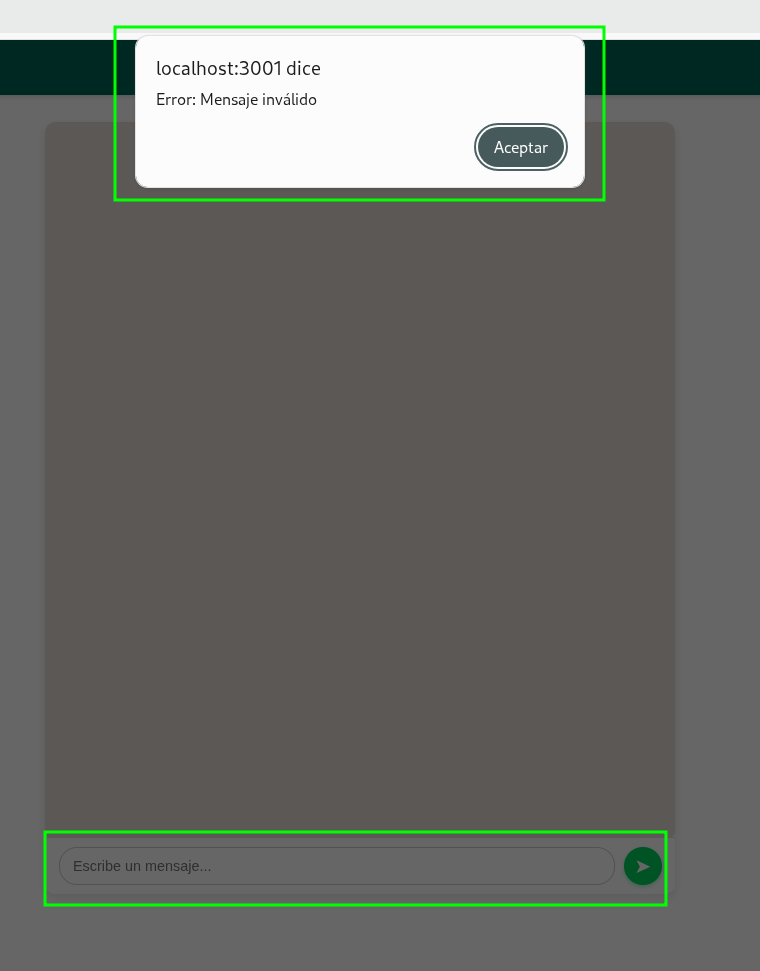
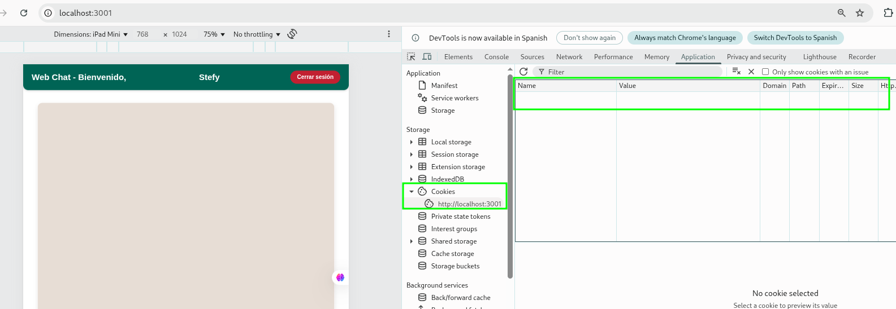
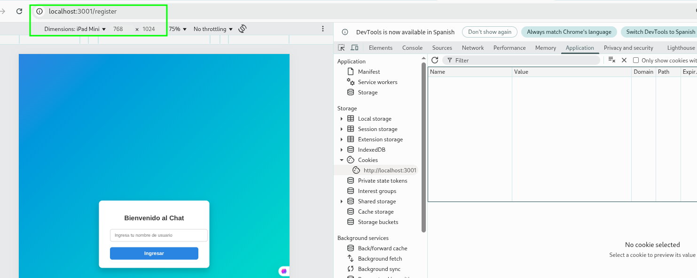
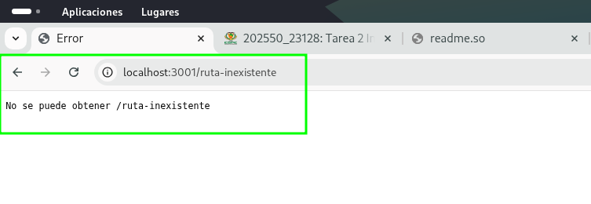
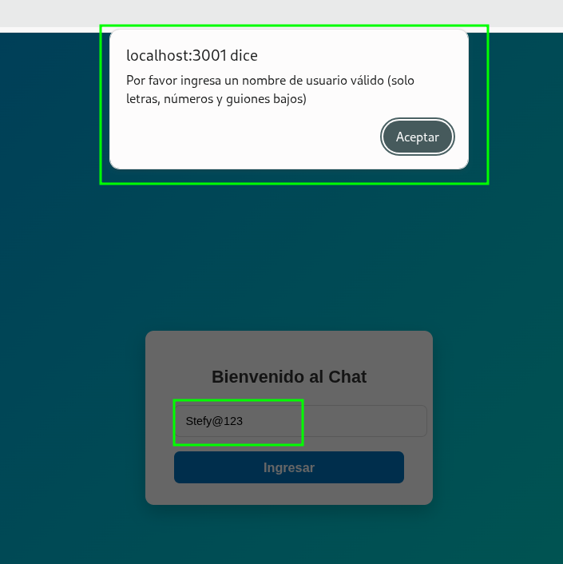

## 📄 **Informe Técnico: Manejo de Excepciones en Node.js con Aplicación de Chat Socket.IO**

**Nombre:** Stefanny Mishel Hernández Buenaño

**Carrera / Curso:** Ingeniería en Tecnologías de la Información

**Fecha de Entrega:** 26 de junio de 2025


###  Introducción

El manejo de excepciones es una práctica crítica en el desarrollo backend, especialmente en entornos de ejecución asincrónica como Node.js. Permite capturar y gestionar errores sin que la aplicación falle abruptamente, ofreciendo respuestas claras al usuario y facilitando el mantenimiento del código. En este informe se analizarán las estrategias más efectivas para controlar errores en Node.js, aplicadas a un proyecto real: un chat en tiempo real desarrollado con Socket.IO.

---

##  Tecnologías Utilizadas

- Node.js
- Express
- Socket.IO
- JavaScript (Frontend)
- HTML + CSS
- Cookies para sesión simple

---

##  Características Implementadas

- Chat en tiempo real por sockets
- Registro básico de usuario con cookie
- Validación de inputs del lado cliente
- Middleware de autenticación
- Middleware global de manejo de errores
- Logging de errores en consola
- Respuestas HTTP estándar (`401`, `500`)
- Emisión de errores personalizados vía Socket.IO

---

###  Tipos de Errores en Node.js

1. **Errores de sintaxis (`SyntaxError`)**
   Ocurren al escribir código inválido: por ejemplo, paréntesis sin cerrar o uso incorrecto de palabras clave.

2. **Errores en tiempo de ejecución (`TypeError`, `ReferenceError`)**

   * `TypeError`: Llamar a una función sobre algo que no lo es (`undefined()`).
   * `ReferenceError`: Acceder a una variable no definida.

3. **Errores del sistema (`SystemError`)**
   Derivan de fallos a nivel de sistema operativo, como problemas con la red o archivos.

4. **Errores personalizados (`CustomError`)**
   Errores definidos por el desarrollador para validar lógicas de negocio específicas, útiles en autenticación o validación de datos.

---

###  Buenas Prácticas para el Manejo de Excepciones

* **Bloques `try-catch`**
  Se usaron en rutas Express y lógica de conexión de sockets para capturar errores sin interrumpir el flujo.

* **Errores asincrónicos (`async/await`, `Promise.catch`)**
  Aunque el proyecto es sincrónico, en una ampliación futura los controladores podrían usar funciones `async` para manejo robusto de base de datos o APIs externas.

* **Middleware de errores**
  Se añadió un middleware global en Express para interceptar y responder adecuadamente a errores no manejados.

* **Logging de errores**
  Se utilizó `console.error`, y se dejó preparado para integrarse con herramientas como `winston`.

* **Respuestas HTTP claras**
  El middleware responde con códigos como `401` (no autenticado) o `500` (error interno), mejorando la comunicación con el cliente.

---

## 🛠️ Manejo de Excepciones Implementado en el Chat con Socket.IO

En el desarrollo del sistema de chat en tiempo real, se aplicaron diversas estrategias de **manejo de excepciones** para garantizar robustez, claridad ante fallos, y una mejor experiencia de usuario. A continuación se detallan los principales puntos implementados:


### 🧪 Ejemplo 1: Conexión de Sockets (`realTimeServer.js`)

```js
io.on("connection", (socket) => {
  try {
    const cookie = socket.handshake.headers.cookie;
    if (!cookie) throw new Error("No se encontró cookie de usuario");
    const user = cookie.split("=").pop();

    socket.on("message", ({ message }) => {
      if (!message || typeof message !== "string") {
        socket.emit("error", "Mensaje inválido");
        return;
      }
      io.emit("message", { user, message, senderId: socket.id });
    });
  } catch (err) {
    console.error("Error en conexión de socket:", err.message);
    socket.emit("error", "Error interno en la conexión");
  }
});
```


> Se implementó validación de existencia de `cookie`, estructura de mensaje y uso de `try-catch`.


### 🧪 Ejemplo 2: Rutas Express con Validación (`routes/index.js`)

```js
router.get("/", isLoggedIn, (req, res, next) => {
  try {
    res.sendFile(views + "/index.html");
  } catch (err) {
    next(err); // Se delega el error al middleware global
  }
});
```





> Las rutas están encapsuladas con `try-catch` para capturar errores al renderizar vistas.


### 🧪 Ejemplo 3: Middleware Global de Errores (Express)

```js
app.use((err, req, res, next) => {
  console.error(err.stack);
  res.status(err.status || 500).json({ error: err.message || "Error interno" });
});
```



> Este middleware garantiza respuestas HTTP consistentes y centraliza la lógica de errores.


### 🧪 Ejemplo 4: Manejo de Errores desde el Servidor en el Cliente (`script.js`)

```js
socket.on("error", (msg) => {
  alert("Error: " + msg);
});
```

> Permite mostrar retroalimentación inmediata al usuario cuando ocurre un error del lado del servidor.


### 🧪 Ejemplo 5: Validación de Usuario en Registro (`register.js`)

```js
const login = document.querySelector("#login");

login.addEventListener("click", () => {
  try {
    const user = document.querySelector("#username").value.trim();
    if (user && /^[a-zA-Z0-9_]+$/.test(user)) {
      document.cookie = `username=${user}; path=/`;
      document.location.href = "/";
    } else {
      alert("Por favor ingresa un nombre de usuario válido (solo letras, números y guiones bajos)");
    }
  } catch (err) {
    alert("Ocurrió un error inesperado al registrar el usuario.");
    console.error("Error en registro:", err);
  }
});
```



> Evita registros inválidos y asegura que el usuario sea válido antes de guardar la cookie.

---

##  Reutilización del Código y Buenas Prácticas

*  **Puntos Críticos Identificados**: `realTimeServer.js`, rutas protegidas, autenticación (`isLoggedIn.js`) y lógica de registro.
*  **Refactorización Responsable**: Se mantuvo la lógica original, encapsulando procesos críticos en `try-catch` y validando entradas.
*  **Ventajas Obtenidas**:

  * Mayor control sobre errores inesperados.
  * Código más limpio y mantenible.
  * Mejor experiencia para el usuario ante fallos.
  * Preparación para escalar a proyectos más grandes.

---

##  Middleware Centralizado de Errores (Express)

```js
app.use((err, req, res, next) => {
  console.error(err.stack);
  res.status(err.status || 500).json({ error: err.message || "Error interno del servidor" });
});
```

> Permite una gestión unificada de errores en toda la aplicación, mejora la depuración y previene respuestas inconsistentes.

---

### Conclusiones

A lo largo de esta tarea, pude comprender y aplicar de manera práctica la importancia del manejo adecuado de excepciones en aplicaciones desarrolladas con Node.js. Iniciar con un proyecto existente como el chat en tiempo real me permitió ver con claridad dónde pueden surgir errores comunes, tanto en el backend (como rutas Express, eventos de Socket.IO, y middlewares), como en el frontend (validación de usuarios, envío de mensajes, etc.).

Implementar bloques try-catch, validar correctamente los datos que entran y salen, y centralizar los errores en un middleware global no solo fortaleció la estructura del proyecto, sino que también mejoró significativamente la experiencia del usuario. Ahora, si algo sale mal, la aplicación no se rompe silenciosamente: da retroalimentación clara y controlada.

Además, entendí que manejar errores no es solo para "evitar que se caiga todo", sino una práctica esencial para construir software robusto, escalable y mantenible. También me enfrenté a algunos desafíos técnicos, especialmente al identificar los puntos críticos del código y entender cómo comunicar los errores correctamente al cliente, pero al resolverlos, reforcé mis habilidades de depuración y análisis.

---

### 📚 Referencias

* [Node.js Docs – Errors](https://nodejs.org/api/errors.html)
* [Express Docs – Error Handling](https://expressjs.com/en/guide/error-handling.html)
* [Socket.IO Docs](https://socket.io/docs/v4/)
* [Winston Logging Library](https://github.com/winstonjs/winston)

---
